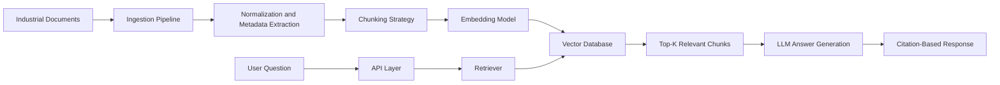
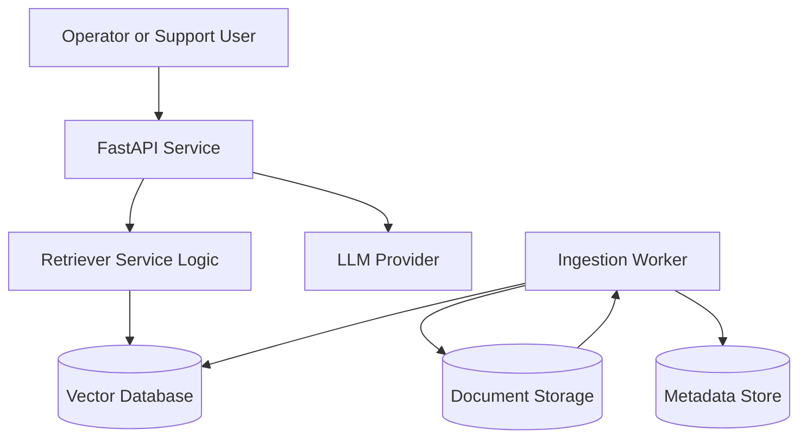

# Architecture

## Objective

The Industrial RAG Knowledge Assistant is designed to answer technical support and operations questions using trusted source documents such as manuals, service bulletins, troubleshooting guides, and SOPs.

## High-Level Flow

## Main Components

### 1. Document Sources

Typical document inputs:

- Equipment manuals
- Maintenance procedures
- Troubleshooting guides
- Safety instructions
- Spare parts references
- Service knowledge base articles

### 2. Ingestion Pipeline

The ingestion layer handles:

- File intake from uploads, storage buckets, or document repositories
- OCR or text extraction where needed
- Document normalization into clean text
- Metadata capture such as source, page, section, equipment model, and revision

Public showcase note:
This repository includes sample ingestion artifacts only, not the full production ingestion workflow.

### 3. Chunking Strategy

Chunking is designed for technical retrieval quality rather than generic paragraph splitting.

Recommended chunk metadata:

- `document_id`
- `source_file`
- `section_title`
- `page_number`
- `equipment_model`
- `revision`
- `chunk_id`

Recommended chunking rules:

- Prefer semantic sections over fixed-size splits when possible
- Preserve headings and procedure steps
- Keep chunks short enough for precise retrieval
- Include overlap for continuity across adjacent sections
- Store citation anchors with each chunk

### 4. Embeddings and Vector Storage

Each chunk is converted into an embedding vector and stored with metadata in a vector database such as Qdrant, pgvector, Pinecone, Weaviate, or OpenSearch vector features.

Stored record structure typically includes:

- Chunk text
- Embedding vector
- Searchable metadata
- Citation reference
- Optional tags for plant, product line, or knowledge domain

### 5. Retrieval Layer

When a user submits a question:

1. The query is embedded.
2. The vector store returns top matching chunks.
3. Optional metadata filters reduce irrelevant matches.
4. The API assembles a context window from the best-supported sources.

Potential ranking improvements:

- Hybrid retrieval using keyword plus vector search
- Reranking for technical relevance
- Domain-specific filters by equipment family or site

### 6. Answer Generation

The LLM receives:

- The user question
- Retrieved chunk excerpts
- Citation metadata
- Guardrails to avoid unsupported claims

Expected answer behavior:

- Answer directly when evidence exists
- Cite the supporting sources
- State uncertainty when support is weak
- Avoid hallucinating maintenance procedures or safety claims

### 7. API Layer

The showcase API demonstrates:

- Health check
- Sample ingestion status
- Search endpoint
- Citation-based Q&A endpoint

The full production service would usually also include:

- Authentication and authorization
- Job queues
- Background workers
- Usage logging
- Monitoring and audit trails

## Reference Topology

## Safety and Portfolio Considerations

This public repository intentionally avoids:

- Real client documentation
- Full backend business logic
- Proprietary prompts
- Production observability pipelines
- Secrets and infrastructure credentials

Instead, it focuses on architecture clarity and implementation approach.
