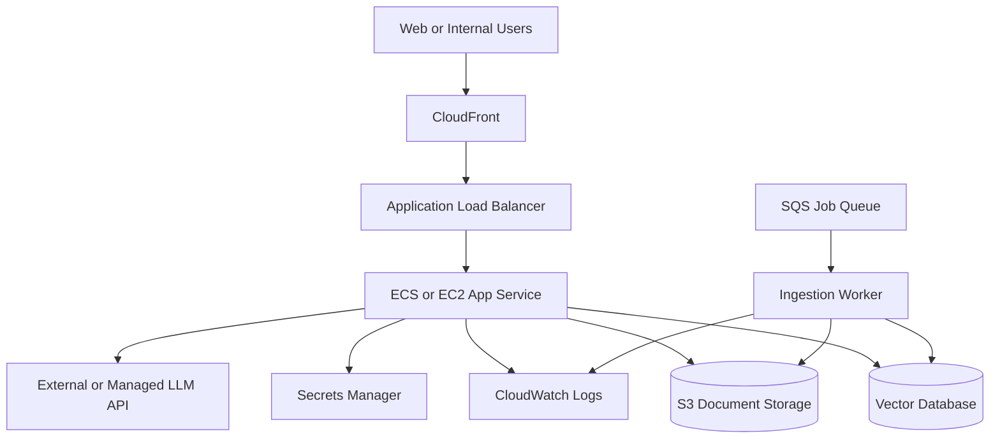

# AWS Deployment Overview

## Purpose

This document outlines a production-style AWS topology for hosting an Industrial RAG Knowledge Assistant. It is intentionally high level and omits internal account details, IAM policies, networking specifics, and credentials.

## Example AWS Topology

## Core AWS Services

### Application Layer

- `Amazon ECS` or `EC2` for hosting the API and worker services
- `Application Load Balancer` for routing traffic to the API
- `CloudFront` for public distribution if a frontend is added

### Storage Layer

- `Amazon S3` for source document storage and ingestion staging
- `Amazon RDS` or another metadata store for structured records
- A vector database hosted either on AWS or externally

### Background Processing

- `Amazon SQS` for ingestion and reindexing jobs
- Worker containers for OCR, parsing, chunking, and embedding

### Security and Operations

- `AWS Secrets Manager` for API keys and secrets
- `CloudWatch` for logs, alarms, and metrics
- `IAM` roles with least-privilege access
- VPC isolation for internal services

## Deployment Pattern

1. Documents are uploaded to `S3`.
2. An event or job message is placed on `SQS`.
3. An ingestion worker parses and chunks the document.
4. Embeddings are generated and stored in the vector database.
5. The API service retrieves context and calls the LLM.
6. Users receive grounded answers with citations.

## Suggested Environment Separation

- `dev` for internal iteration and evaluation
- `staging` for validation and demo readiness
- `prod` for controlled business use

Each environment should isolate:

- Buckets
- Databases
- Secrets
- Networking
- Logging and alarms

## Deployment Concerns for Industrial Use Cases

- Traceability of answers and source documents
- Strong access control for internal knowledge
- Revision awareness for manuals and procedures
- Monitoring for failed ingestion jobs
- Guardrails around unsupported maintenance or safety guidance

## Public Repo Boundary

This showcase does not include:

- Terraform or CloudFormation for private infrastructure
- VPC design specifics
- Security group rules
- Real ARNs, account IDs, domain names, or credentials
- Client-specific deployment topology

Use this document as a portfolio overview, not a direct production rollout guide.
